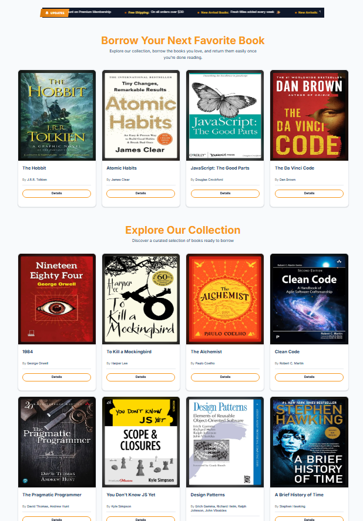
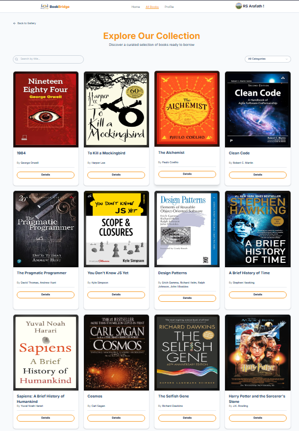

# 📚 BookBridge

> A modern book borrowing platform where readers can explore a curated library, check book details, and borrow their next favorite read — all in a clean, fast, Next.js-powered experience.

<p align="center">
  <a href="https://book-bridge-kappa.vercel.app/"></a>
  <a href="https://github.com/RS-Arafath/BookBridge"></a>
  <a href="https://rs-arafath.vercel.app"></a>
</p>

## Home
<p align="center">
  
</p>

## Featured Books and All Books
<p align="center">
  
  
</p>

---

## 📖 Overview

**BookBridge** is a full-stack Next.js application built as a digital library — readers can browse a growing collection of books across genres, view detailed pages for each title, and borrow a book in a single click. The homepage walks new visitors through a featured-books carousel, the full collection, a "How It Works" borrowing guide, and reader testimonials, while authenticated users get a personal profile space.

This project was built to strengthen real-world Next.js App Router skills — including server components, authenticated routes, third-party auth (Google OAuth via Better Auth), MongoDB data modeling, and building a consistent design system on top of HeroUI.

---

## ✨ Features

- **🏠 Landing Experience** — Hero section, auto-rotating marquee banner, featured books carousel, and a 4-step "How It Works" guide for new users
- **📚 Book Catalog** — Browse the full collection on `/allBooks`, with dedicated detail pages per book (`/featureBooks/[id]`, `/featurePhoto/[id]`)
- **🔄 One-Click Borrowing** — A dedicated `BorrowButton` client component handles the borrow action with instant `react-hot-toast` feedback, without needing to make the whole page a client component
- **🔐 Authentication** — Secure sign-in with **Google OAuth**, powered by [Better Auth](https://www.better-auth.com/) and its official MongoDB adapter
- **👤 Profile Page** — Session-aware profile route for logged-in users
- **🎠 Carousels & Marquee** — Smooth image sliders built with [Swiper](https://swiperjs.com/) and an animated brand marquee via `react-fast-marquee`
- **💬 Testimonials Section** — Reader feedback displayed in a clean card layout
- **⚡ Server Components First** — Book listing and detail pages are server-rendered for speed and SEO, with client components isolated only where interactivity (toasts, borrowing) is needed
- **📱 Fully Responsive** — Built mobile-first with Tailwind CSS
- **📊 Analytics** — Vercel Analytics integrated for traffic insights

---

## 🛠️ Tech Stack

| Category | Technology |
|---|---|
| Framework | [Next.js 16](https://nextjs.org/) (App Router) |
| UI Library | [HeroUI v3](https://heroui.com/) |
| Styling | [Tailwind CSS v4](https://tailwindcss.com/) |
| Authentication | [Better Auth](https://www.better-auth.com/) + `@better-auth/mongo-adapter` (Google OAuth) |
| Database | [MongoDB](https://www.mongodb.com/) |
| Carousel / Slider | [Swiper](https://swiperjs.com/) |
| Icons | Lucide React, React Icons, Iconify |
| Animation | `@react-spring/web` |
| Notifications | React Hot Toast |
| Marquee | `react-fast-marquee` |
| Additional Components | `@gravity-ui/uikit` |
| Analytics | Vercel Analytics |
| Deployment | Vercel |

---

## 🚧 Challenges Faced & How They Were Solved

Documenting a few real debugging moments from building this project:

### 1. Nested Interactive Elements
Book cards originally wrapped the entire card — including the borrow button — inside a single `<Link>`, which caused invalid nested-interactive-element errors and unpredictable click behavior. Fixed by extracting the borrow action into its own `BorrowButton` client component placed outside the card's link boundary, so clicking "Borrow" no longer triggers navigation.

### 2. Server/Client Component Boundaries
Keeping book listing and detail pages (`FeatureImage.jsx`, `PhotoDetails.jsx`) as server components for performance meant the borrow interaction — which needs client-side state for the toast notification — had to be isolated into a small, dedicated client component rather than converting the whole page, keeping the server-rendering benefits intact.

### 3. Dynamic Route Params Handling
Next.js's async `params` API in dynamic routes (`/featureBooks/[id]`, `/featurePhoto/[id]`) required awaiting params before use, which initially caused runtime errors when accessed synchronously. Fixed by properly awaiting `params` in each route's server component.

### 4. Image Props & Optimization
Passing inconsistent image prop shapes (string URLs vs. object metadata) into `next/image` across different book data sources caused type mismatches. Standardized the book data shape so every image reference passes a consistent `src`, `alt`, and dimensions into the `Image` component.

### 5. Authentication with Google OAuth
Wiring up Better Auth with the MongoDB adapter for Google sign-in required careful environment configuration (client ID/secret, base URL, trusted origins) to work correctly both locally and on Vercel's production domain.

---

## ⚙️ Getting Started

### Prerequisites
- Node.js 18+
- A MongoDB database (local or Atlas)
- Google OAuth credentials (Client ID & Secret)

### Installation

```bash
git clone https://github.com/RS-Arafath/BookBridge.git
cd BookBridge
npm install
```

### Environment Variables

Create a `.env` file in the root directory:

```env
MONGODB_URI=your_mongodb_connection_string
BETTER_AUTH_SECRET=your_secret_key
BETTER_AUTH_URL=http://localhost:3000
GOOGLE_CLIENT_ID=your_google_client_id
GOOGLE_CLIENT_SECRET=your_google_client_secret
```

### Run Locally

```bash
npm run dev
```

Visit `http://localhost:3000` to view the app.

### Build for Production

```bash
npm run build
npm run start
```

---

## 🗺️ Roadmap

- [ ] Borrow history & due-date tracking
- [ ] Search & genre-based filtering
- [ ] Admin dashboard for managing the book inventory
- [ ] Book reviews & ratings

---

## 🤝 Contributing

This is primarily a personal learning project, but suggestions and feedback are always welcome. Feel free to open an issue or fork the repo.

---

## 📬 Contact

- **Email:** contact.arafath.bd@gmail.com
- **GitHub:** [github.com/RS-Arafath](https://github.com/RS-Arafath)
- **Portfolio:** [rs-arafath.vercel.app](https://rs-arafath.vercel.app)

---

<p align="center">Made with ❤️ by RS Arafath</p>